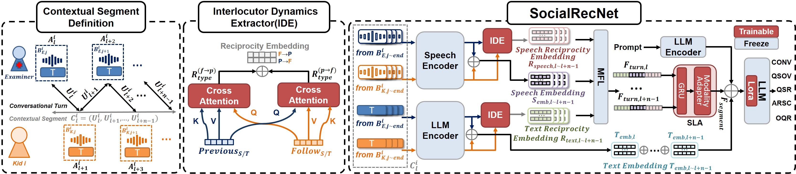

# SocialRecNet

## Overview


*Overview of SocialRecNet framework: The left section shows conversational turn units and contextual segments. The middle section highlights the Interlocutor Dynamics Extractor (IDE), which uses cross-attention to compute reciprocal embeddings for speech and text. The right section depicts how these embeddings are processed through Modality Fusion Layer (MFL), Segment-Level Aggregation Layer (SLA), and a LoRA-adapted LLM to predict ADOS scores.*

## Abstract

Accurately assessing social reciprocity is essential for the early diagnosis and intervention of autism. Traditional approaches often rely on unimodal data and single-turn conversation analysis, which may fail to fully capture the complexity of social interactions. To address these limitations, we have developed SocialRecNet, a novel multimodal large language model that integrates speech and text to analyze social reciprocity across multiple conversational turns. Leveraging the Autism Diagnostic Observation Schedule (ADOS) dataset, SocialRecNet employs an Interlocutor Dynamics Extractor (IDE) with cross-attention mechanisms to detect subtle interaction dynamics. Our model achieves an average Pearson correlation of 0.711 in predicting ADOS scores, representing a significant improvement of approximately 26.24% over the best-performing baseline methods. This research enhances quantitative analysis and provides deeper insights into ASD diagnosis and intervention.

## Getting Started

To get started with SocialRecNet, follow these steps:

1. **Preprocessing Data**: Run the following command to prepare the data:
   ```bash
   python prepare.py
2. **Training the Model**: Execute the script to train the model:
   ```bash
   bash train.sh
3. **Inference**: Use the following command to perform inference: 
   ```bash
   bash inference.sh
