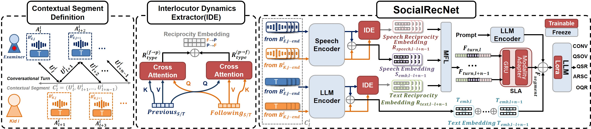

# SocialRecNet: A Multimodal LLM-Based Framework for Assessing Social Reciprocity in Autism Spectrum Disorder

## Overview


*Overview of SocialRecNet framework: The left section shows conversational turn units and contextual segments. The middle section highlights the Interlocutor Dynamics Extractor (IDE), which uses cross-attention to compute reciprocal embeddings for speech and text. The right section depicts how these embeddings are processed through Modality Fusion Layer (MFL), Segment-Level Aggregation Layer (SLA), and a LoRA-adapted LLM to predict ADOS scores.*

## Abstract

Accurate assessment of social reciprocity is crucial for early diagnosis and intervention in Autism Spectrum Disorder (ASD). Traditional methods, often relying on unimodal data or lacking in cross-modal alignment, do not fully capture the complexity of social reciprocity. To address these limitations, we developed SocialRecNet, a novel Multimodal Large Language Model (MLLM) utilizing the Autism Diagnostic Observation Schedule (ADOS) dataset. SocialRecNet integrates conversational speech and text with the textual reasoning capabilities of LLMs to analyze social reciprocity across multiple dimensions. By effectively aligning speech and text, enhanced by properly designed prompts, SocialRecNet achieves an average Pearson correlation of 0.711 in predicting ADOS scores, marking a significant improvement of approximately 26.24% over the best-performing baseline method. This state of the art framework not only improves the prediction of social reciprocity scores but also provides deeper insights into ASD diagnosis and intervention strategies.

## Getting Started


### 0. Environment Setup

First, install the required dependencies:

```bash
pip install -r requirements.txt
```
### 1. Preprocessing Data

To preprocess the data, adjust the following paths and parameters in the prepare.py script to fit your dataset and work setup:

transcript_path: Path to transcript data.
scores_path: Path to score labels.
audio_folder: Path to audio files.
jsonl_train_output_path: Path to save preprocessed training data.
jsonl_test_output_path: Path to save preprocessed test data.
Optional: Modify turns_per_segment, label, and speaker as needed.
```bash
cd Data_Prepare
python generate_jsonl.py
```
The processed data will be in the following format:
```json
{
  "case_name": "case name", 
  "input": "Doctor: transcript1 Kid: transcript2", 
  "output": "CONV = 1, QSOV = 0, QSR = 2, ARSC = 2, QQR = 3", 
  "audio_file": "audio_path1.wav,audio_path2.wav"
}
```

### 2. Training the Model
To start training, customize the training parameters if necessary, and run the following script:

```bash
bash train.sh
```
Alternatively, use the command below to start training:
```bash
CUDA_VISIBLE_DEVICES=1 WANDB_MODE=offline python -m torch.distributed.run --master_port=20005 --nproc_per_node=1 SocialRecNet/train.py \
    --deepspeed SocialRecNet/config/config.json \
    --data $DATA_ROOT \
    --output_dir ${SAVE_ROOT} \
    --manifest_files "path to training jsonl file" \
    --remove_unused_columns False \
    --seed 1 \
    --do_train True \
    --learning_rate 5e-5 \
    --weight_decay 0.05 \
    --max_grad_norm 1.0 \
    --warmup_steps 1000 \
    --per_device_train_batch_size 1 \
    --gradient_accumulation_steps 12 \
    --num_train_epochs 10 \
    --llama_model $llama_path \
    --disable_tqdm True \
    --logging_steps 10 \
    --save_steps 200 \
    --save_total_limit 1
```
### 3. Inference
To perform inference, run the following script:
```bash
bash inference.sh
```
Or manually use the command below:
```bash
CUDA_VISIBLE_DEVICES=1 python SocialRecNet/inference.py \
    --input_file "path to test jsonl file" \
    --output_file "path to save result" \
    --SocialRecNet_model "path to your model" \
    --peft_model_id "path to your model/llm" \
    --llama_model "path to llama model"
```
### 4. Evaluate result
To get the final result, run the following script:
```bash
python Evaluate/evaluate_by_kid.py
```
